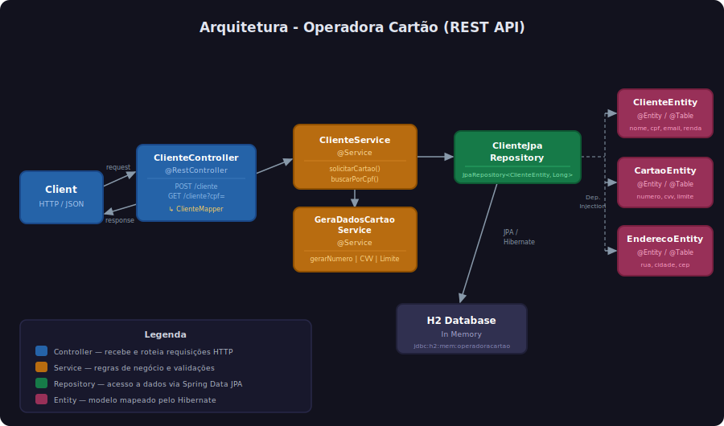
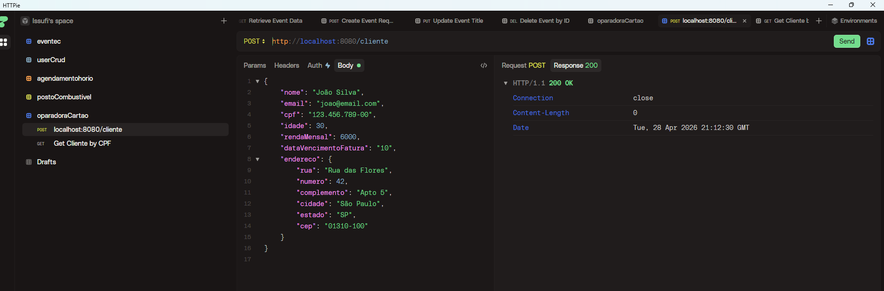

# Operadora Cartão

API REST para gestão de cartões de crédito. Permite que clientes solicitem cartões, com geração automática de número, CVV, data de expiração e limite de crédito com base em perfil de renda e idade.

## Arquitetura



## Demo



## Tecnologias

| Tecnologia                  | Versão  |
|-----------------------------|---------|
| Java                        | 21 LTS  |
| Spring Boot                 | 3.5.0   |
| Spring Data JPA             | 3.5.0   |
| SpringDoc OpenAPI (Swagger) | 2.8.6   |
| MapStruct                   | 1.6.3   |
| Lombok                      | -       |
| H2 Database                 | runtime |
| JUnit 5                     | -       |
| Gradle                      | 8.14    |

## Pré-requisitos

- JDK 21+
- Gradle 8.x (ou use o wrapper incluído `./gradlew`)

## Executando o projeto

```bash
./gradlew bootRun
```

A aplicação sobe em `http://localhost:8080`.

## Swagger UI

Após subir a aplicação, acesse a documentação interativa:

- **Swagger UI:** `http://localhost:8080/swagger-ui.html`
- **OpenAPI JSON:** `http://localhost:8080/v3/api-docs`

## Endpoints

### Solicitar cartão

```http
POST /cliente
Content-Type: application/json
```

**Body:**

```json
{
  "nome": "João Silva",
  "email": "joao@email.com",
  "cpf": "123.456.789-00",
  "idade": 30,
  "rendaMensal": 6000,
  "dataVencimentoFatura": "10",
  "endereco": {
    "rua": "Rua das Flores",
    "numero": 42,
    "complemento": "Apto 5",
    "cidade": "São Paulo",
    "estado": "SP",
    "cep": "01310-100"
  }
}
```

**Resposta 200:**

```json
{
  "nome": "João Silva",
  "email": "joao@email.com",
  "idade": 30,
  "cpf": "123.456.789-00",
  "cartao": {
    "numero": "4000XXXXXXXXXXXX",
    "dataExpiracao": "2028-07-01",
    "cvv": "374",
    "limite": 5000.0
  }
}
```

### Buscar cliente por CPF

```http
GET /cliente?cpf=123.456.789-00
```

**Resposta 200:** mesmo formato acima com os dados do cliente e cartão gerado.

## Regras de limite de crédito

| Faixa de Idade | Renda Mensal   | Limite    |
|----------------|----------------|-----------|
| 18–25 anos     | < R$ 3.000     | R$ 1.000  |
| 18–25 anos     | R$ 3.000–5.999 | R$ 3.000  |
| 18–25 anos     | ≥ R$ 6.000     | R$ 5.000  |
| 26–40 anos     | < R$ 4.000     | R$ 2.000  |
| 26–40 anos     | R$ 4.000–7.999 | R$ 5.000  |
| 26–40 anos     | ≥ R$ 8.000     | R$ 10.000 |
| 40+ anos       | < R$ 5.000     | R$ 3.000  |
| 40+ anos       | R$ 5.000–9.999 | R$ 8.000  |
| 40+ anos       | ≥ R$ 10.000    | R$ 15.000 |

## Estrutura do projeto

```text
src/main/java/com/issufibadji/operadoracartao/
├── OperadoraCartaoApplication.java
├── business/
│   └── services/
│       ├── ClienteService.java
│       └── GeraDadosCartaoService.java
├── controller/
│   ├── ClienteController.java
│   ├── dto/
│   │   ├── request/
│   │   │   ├── ClienteRequestDTO.java
│   │   │   └── EnderecoRequestDTO.java
│   │   └── response/
│   │       ├── ClienteResponseDTO.java
│   │       └── CartaoResponseDTO.java
│   └── mappers/
│       └── ClienteMapper.java
└── infrastructure/
    ├── entities/
    │   ├── ClienteEntity.java
    │   ├── CartaoEntity.java
    │   └── EnderecoEntity.java
    └── repositories/
        └── ClienteJpaRepository.java
```

## Testes

```bash
./gradlew test
```
